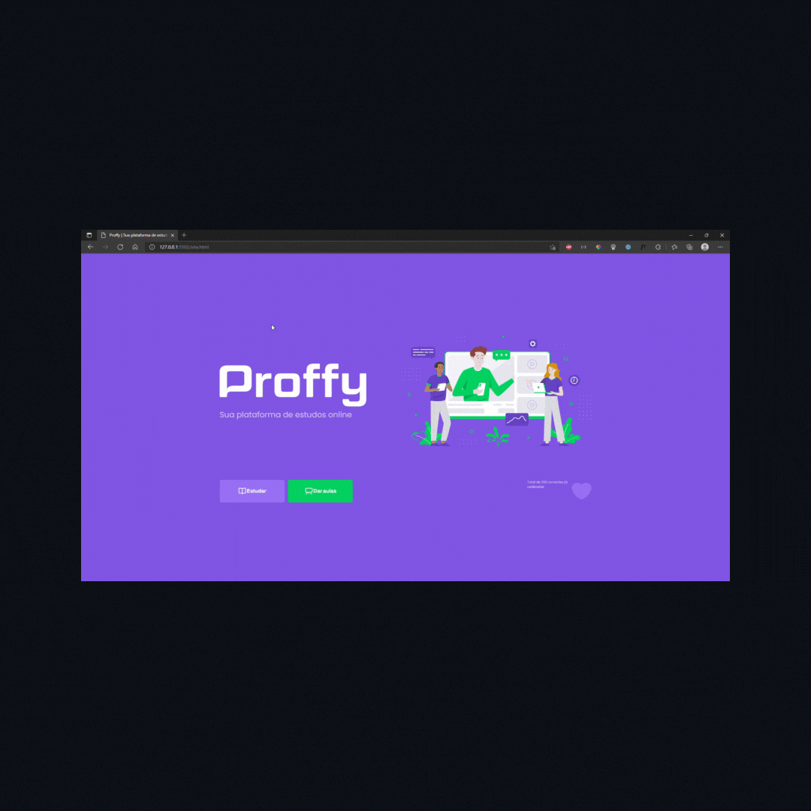

<h1 align="center">
    
</h1>

<h1>
    
</h1>

## 👀 Sobre

Proffy é um projeto Front-end de uma plataforma de estudos, criada a partir da semana Next Level Week da Rocketseat. 

---

## 🛠 Tecnologias utilizadas

O projeto foi desenvolvido utilizando as seguintes tecnologias

- Javascript
- Html
- Css

---

## 💡 Como baixar o projeto

```bash

    # Clonar o repositório
    $ git clone https://github.com/pedrow42/education_site

    ## Entrar no diretório
    $ cd education_site/public

    ## Inicie o sistema
      site.html
```